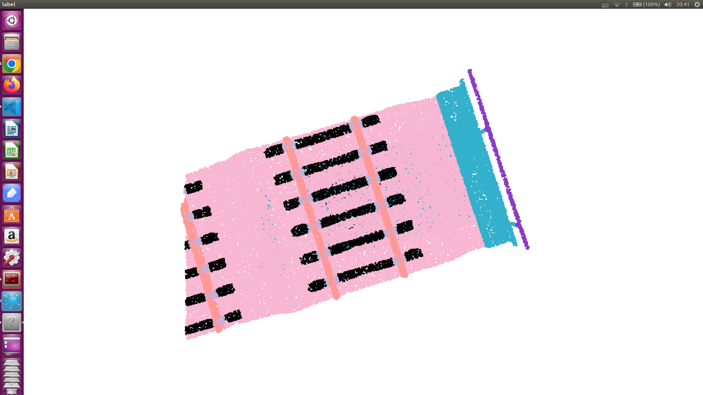

# scp directory
train, eval related code

## scripts

just for preprocess, fellow:
1. joint.py 
2. split_sample.py sample sample to `train` and `test`
3. downsample.py


# scp_result directory

pretrained model

# How to run
preprocess your samples fellowing `scripts` directory, and configure some params, then run:

```
scp\ConvPoint\examples\npm3d\run.sh
```

## result


